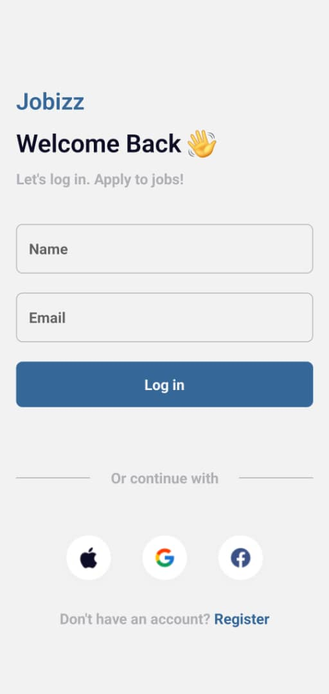

# rn-assignment4-11028723

## Description

This application is designed to enhance productivity and organization by efficiently managing tasks and job listings. The app features a login screen where users enter their name and email, which are then passed to the home screen. The home screen displays these details and showcases job listings in two sections: popular and featured jobs. Each job listing is displayed using a custom `JobCard` component.
### Components

#### `LoginScreen`
- A screen that allows users to log in by entering their name and email.
- On login, passes the name and email to the `HomeScreen`.

#### `HomeScreen`
- Displays the name and email passed from the `LoginScreen`.
- Contains sections for popular and featured job cards.

#### `JobCard`
- A functional component to display job details.
- Accepts props for card details and displays them accordingly.
- Used to display at least 8 different job cards in both the popular and featured sections.

## Student ID

11028723

## Screenshot



## Instructions to Run the Project

1. Clone the repository:

   ```bash
   git clone https://github.com/KelvinLinnaeus/rn-assignment4-11028723.git
   cd rn-assignment4-11028723
   ```

2. Install the dependencies:

   ```bash
   npm install
   ```

3. Start the Expo development server:

   ```bash
   npx expo start
   ```

4. Use the Expo Go app on your mobile device or an emulator to view the application.
